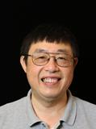

Hi, I am Li Chen. I have been a software engineer for nearly 30 years after Ph.D. I am still doing hands-on work every day. Learning is what kept me going from becoming a dinosaur. For the past 30 years, I have worked on a wide variety of things. I often have to relearn when I revisit a subject as things have advanced so much. One of the motivations for writing this blog is to document my learning and catch the major decisions I made. I hope the contents of this blog will be useful for others as well.

I am currently working for AWS Center for Quantum Computing. I had the luxury of looping back to serve a new generation of physicists after I left the physicist field. I have the great opportunity to work with an extraordinarily high concentration of very talented people here (as evident in a Linked-in search of the organization). I am working around the software/hardware interface where we have to push many things to the limit. I had the opportunities to learn many things that I was not exposed to before. I want to record many things that I learnt for as long as it does not violate Amazon confidentiality. All opinions in this blog are my own and not the views of my employer.

Here are a few open source projects that I actively contribute to:

[OpenQASM](https://github.com/openqasm/openqasm)

[OpenPulse](https://github.com/openqasm/openpulse-python)

Here is an open source projects that I started but I am no longer contributing:

[Amazon Kinesis Agent for Microsoft Windows](https://github.com/awslabs/kinesis-agent-windows)

Here is my first open source project and hence my screen name. It has served its intended purpose and is now obsolete.

[ASP Classic Compiler](https://github.com/aspcompiler/aspclassiccompiler)
