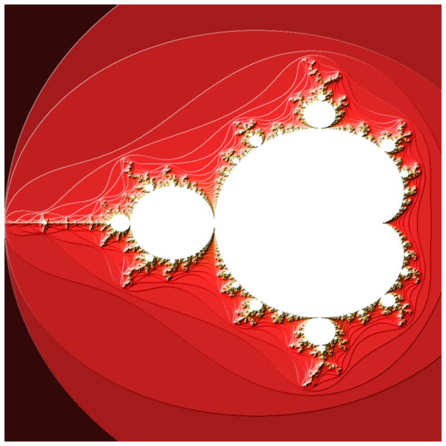

# Introduction

Inspired by the Modular bog series, [part 1](https://www.modular.com/blog/how-mojo-gets-a-35-000x-speedup-over-python-part-1), 
[part 2](https://www.modular.com/blog/how-mojo-gets-a-35-000x-speedup-over-python-part-2), and 
[part 3](https://www.modular.com/blog/mojo-a-journey-to-68-000x-speedup-over-python-part-3), I want to see what kind of speedup
I can get with Rust.

# The baseline

I will use the same Mandelbrot set example. For an explanation of the algorithm, see the part 1 of the Modular blog posts linked above.

```python
import numpy as np
import matplotlib.pyplot as plt
import matplotlib.colors as colors

def mandelbrot_kernel(c, max_iters): 
  z = c
  nv = 0
  for i in range(max_iters):
    if abs(z) > 2:
      break
    z = z*z + c
    nv += 1
  return nv

def compute_mandelbrot(min_x, max_x, min_y, max_y, width, height, iters):
    # create a matrix. Each element of the matrix corresponds to a pixel
    t = [[0 for _ in range(width)] for _ in range(height)]

    dx = (max_x - min_x) / width
    dy = (max_y - min_y) / height

    y = min_y
    for row in range(height):
        x = min_x
        for col in range(width):
            t[row][col] = mandelbrot_kernel(complex(x, y), iters)
            x += dx
        y += dy
    return np.array(t)

def show_plot(numpy_array):
    scale = 10
    dpi = 64

    height, width = numpy_array.shape
    fig = plt.figure(1, [scale, scale * height // width], dpi)
    ax = fig.add_axes([0.0, 0.0, 1.0, 1.0], False, 1)
    light = colors.LightSource(315, 10, 0, 1, 1, 0)

    image = light.shade(numpy_array, plt.cm.hot, colors.PowerNorm(0.3), "hsv", 0, 0, 1.5)
    plt.imshow(image)
    plt.axis("off")
    plt.show()

width = 960
height = 960
min_x = -2.0
max_x = 0.6
min_y = -1.5
max_y = 1.5
iters = 200

tensor = []
%timeit -n 1 -r 1 tensor.append(compute_mandelbrot(min_x, max_x, min_y, max_y, width, height, iters))
tensor = tensor[0]
```

This outputs:

```
6.55 s ± 0 ns per loop (mean ± std. dev. of 1 run, 1 loop each)
```

We can plot the image:

```python
show_plot(tensor)
```



# Accelerating with Numpy

We attempt to accelerate over our base case using Numpy. There are two main ways to do this: vectorization and parallelization.

```python
# This is slower
def compute_mandelbrot_np(min_x, max_x, min_y, max_y, width, height, iters):
    # create a matrix. Each element of the matrix corresponds to a pixel
    x = np.linspace(min_x, max_x, width).reshape((1, width))
    y = np.linspace(min_y, max_y, height).reshape((height, 1))
    C = np.tile(x, (height, 1)) + 1j * np.tile(y, (1, width))

    v_mandelbrot_kernel = np.vectorize(pyfunc=mandelbrot_kernel)
    return v_mandelbrot_kernel(C, iters)

# This is much faster, but only return a bit map
def compute_mandelbrot_np2(min_x, max_x, min_y, max_y, width, height, iters):
    # create a matrix. Each element of the matrix corresponds to a pixel
    x = np.linspace(min_x, max_x, width).reshape((1, width))
    y = np.linspace(min_y, max_y, height).reshape((height, 1))
    C = np.tile(x, (height, 1)) + 1j * np.tile(y, (1, width))
    
    Z = np.zeros((height, width), dtype=complex)
    M = np.full((height, width), True, dtype=bool)
    for i in range(iters):
        Z[M] = Z[M] * Z[M] + C[M]
        M[np.abs(Z) > 2] = False
    return np.uint8(np.flipud(1 - M) * 255)
```

The vectorization produces the identical result but not much speedup. The parallelization is much faster but it does
not exit early when the series diverge so it only returns a black and white bit map.

Vectorization output:

```python
tensor = []
%timeit -n 1 -r 1 tensor.append(compute_mandelbrot_np(min_x, max_x, min_y, max_y, width, height, iters))
tensor = tensor[0]
```

```
6.37 s ± 0 ns per loop (mean ± std. dev. of 1 run, 1 loop each)
```

Parallelization output:

```python
tensor = []
%timeit -n 1 -r 1 tensor.append(compute_mandelbrot_np2(min_x, max_x, min_y, max_y, width, height, iters))
tensor = tensor[0]
```

```
1.78 s ± 0 ns per loop (mean ± std. dev. of 1 run, 1 loop each)
```

# Accelerating with Numba

Numba is a just-in-time compiler for Python. It can compile Python code to machine code at runtime. It also works well with Numpy.

```python
from numba import jit, int32, complex128
import numpy as np

@jit(nopython=True)
def mandelbrot_kernel_nb(x, y, max_iters):
    """
    Given the real and imaginary parts of a complex number,
    determine if it is a candidate for membership in the Mandelbrot
    set given a fixed number of iterations.
    """
    nv = 0
    c = complex(x,y)
    z = 0.0j
    for i in range(max_iters):
        z = z * z + c
        if (z.real * z.real + z.imag * z.imag) >= 4:
            break
        nv += 1
    return nv

@jit(nopython=True)
def compute_mandelbrot_nb(min_x, max_x, min_y, max_y, image, iters):
    height = image.shape[0]
    width = image.shape[1]

    dx = (max_x - min_x) / width
    dy = (max_y - min_y) / height

    y = min_y
    for row in range(height):
        x = min_x
        for col in range(width):
            image[row][col] = mandelbrot_kernel_nb(x, y, iters)
            x += dx
        y += dy
    return image

tensor = []
image = np.zeros((height, width), dtype=np.uint8)
%timeit -n 1 -r 1 tensor.append(compute_mandelbrot_nb(min_x, max_x, min_y, max_y, image, iters))
tensor = tensor[0]
```

Output:

```
619 ms ± 0 ns per loop (mean ± std. dev. of 1 run, 1 loop each)
```

That is a 10x speedup over the base case.

# Accelerating with Rust

We use a Python package called [rustimport](https://github.com/mityax/rustimport) which is based on [PyO3](https://github.com/PyO3/pyo3)
and it can build Rust code dynamically in a Python project:

```python
import rustimport
rustimport.settings.release_mode = True
import rustimport.import_hook
import mandel

image = np.zeros((height, width), dtype=np.uint8)
%timeit -n 1 -r 1 mandel.compute_mandelbrot_rs(min_x, max_x, min_y, max_y, width, height, image, iters)
```

The `import mandel` line above dynamically compiles the Rust code in the same directory called `mandel.rs`:

```rust
// rustimport:pyo3

//: [dependencies]
//: ndarray = "0.15.6"
//: numpy = "^0.18.0"

use pyo3::prelude::*;
use ndarray::{Dim, ArrayViewMut, IxDynImpl};
use numpy::{PyArrayDyn};

#[pyfunction]
fn compute_mandelbrot_rs(
    _py: Python<'_>,
    min_x: f32, 
    max_x: f32, 
    min_y: f32, 
    max_y: f32, 
    width: u32, 
    height: u32, 
    t: &PyArrayDyn<u8>,
    iters: u8,
) {
    let mut a = unsafe { t.as_array_mut() }; 
    compute_mandelbrot(min_x, max_x, min_y, max_y, width, height, iters, &mut a);
}

#[derive(Clone, Copy)]
struct Complex {
    pub a: f32,
    pub b: f32,
}

impl std::ops::Add for Complex {
    type Output = Self;

    fn add(self, rhs: Self) -> Self {
        Complex {
            a: self.a + rhs.a,
            b: self.b + rhs.b,
        }
    }
}

impl std::ops::Mul for Complex {
    type Output = Self;

    fn mul(self, rhs: Self) -> Self {
        Complex { 
            a: self.a * rhs.a - self.b * rhs.b, 
            b: self.a * rhs.b + self.b * rhs.a ,
        }
    }
}

impl Complex {
    fn arg_sq(self) -> f32 {
        self.a * self.a + self.b * self.b
    }
}

fn mandelbrot(x: f32, y: f32, max: u8) -> u8 {
    let mut z = Complex { a: 0.0, b: 0.0 };
    let c = Complex { a: x, b: y };
    let mut i = 0u8;
    while i < max && z.arg_sq() < 4.0 {
        z = z * z + c;
        i += 1;
    }
    return i;
}

fn compute_mandelbrot(min_x: f32, max_x: f32, min_y: f32, max_y: f32, width: u32, height: u32, iters: u8, t: &mut ArrayViewMut<'_, u8, Dim<IxDynImpl>>) {
    let dx = (max_x - min_x) / width as f32;
    let dy = (max_y - min_y) / height as f32;
    let mut y = min_y;
    for row in 0..height {
        let mut x = min_x;
        for col in 0..height{
            t[[row as usize, col as usize]] = mandelbrot(x, y, iters);
            x += dx;
        }
        y += dy;
    }
}
```

As a good practice, we allocate the Numpy array in Python and pass it to Rust to fill in the values. This allows the Python
GIL to manage the memory.

The output is:

```
141 ms ± 0 ns per loop (mean ± std. dev. of 1 run, 1 loop each)
```

This is 46x improvement over the base case. Incidentally, this is the same speedup as the `mandelbrot_0` and `mandelbrot_1` in the 
part 1 of the Modular blog posts. So far everything is running on a single thread so we have explored neither the multi-thread capability
of our Host nor the CPU SIMD capability. These will be explored in the future posts. We also did not try to reproduce
`mandelbrot_2` in the mojo blog where they achieved a 89x speedup. They achieved this using the [FMA instruction set](https://en.wikipedia.org/wiki/FMA_instruction_set); being a compiler project, `mojo` has more control in selecting the instruction set.

# Summary

| Method    | Time (s) | Speedup |
| -------- | ------- | ------- |
| Baseline  | 6.55   | 1.00    |
| Numpy vectorization | 6.37 | 1.03 |
| Numpy parallelization | 1.78 | 3.68 |
| Numba | 0.619 | 10.58 |
| Rust | 0.141 | 46.48 |

